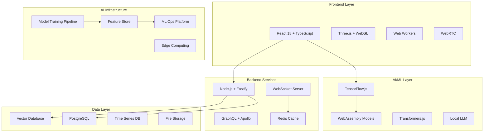

# Neural Flow - Design Document

## Overview

Neural Flow represents a paradigm shift in productivity applications, leveraging cutting-edge AI/ML technologies to create an adaptive, predictive workspace that evolves with user behavior. The system combines real-time behavioral analysis, advanced machine learning models, and seamless multi-modal interactions to deliver an unprecedented productivity experience.

The architecture is built on a modern, scalable tech stack designed for performance, reliability, and extensibility, showcasing the pinnacle of current web development and AI integration capabilities.

## Architecture

### High-Level Architecture



### Technology Stack

**Frontend:**
- **React 18** with Concurrent Features and Suspense for optimal UX
- **TypeScript 5.0** for type safety and developer experience
- **Vite** for lightning-fast development and building
- **Three.js** for 3D visualizations and immersive interfaces
- **Framer Motion** for fluid animations and micro-interactions
- **Tailwind CSS** with custom design system
- **Web Workers** for background processing
- **WebRTC** for real-time collaboration

**AI/ML Stack:**
- **TensorFlow.js** for client-side machine learning
- **Transformers.js** for local language model inference
- **WebAssembly** for high-performance model execution
- **ONNX Runtime** for cross-platform model deployment
- **Local LLM** (Llama 2 7B quantized) for privacy-first AI

**Backend:**
- **Node.js 20** with latest performance optimizations
- **Fastify** for high-performance API server
- **GraphQL** with Apollo Server for flexible data fetching
- **WebSocket** for real-time updates
- **Bull Queue** for background job processing
- **Redis** for caching and session management

**Data & Storage:**
- **PostgreSQL 15** with advanced indexing and partitioning
- **Pinecone/Weaviate** for vector similarity search
- **InfluxDB** for time-series analytics data
- **MinIO** for distributed file storage
- **Prisma** as type-safe database ORM

**Infrastructure:**
- **Docker** containers with multi-stage builds
- **Kubernetes** for orchestration and scaling
- **NGINX** for load balancing and reverse proxy
- **Prometheus + Grafana** for monitoring
- **Elasticsearch** for logging and search

## Components and Interfaces

### 1. Adaptive Workspace Engine

**Purpose:** Core intelligence system that learns user patterns and adapts the interface

**Key Components:**
- **Behavioral Analyzer:** Tracks user interactions, timing, and patterns
- **Context Engine:** Understands current work context from multiple signals
- **Layout Optimizer:** Dynamically adjusts UI based on predicted needs
- **Preference Learner:** Builds user preference models over time

**Implementation:**
```typescript
interface WorkspaceEngine {
  analyzeUserBehavior(interactions: UserInteraction[]): BehaviorPattern;
  predictNextAction(context: WorkContext): ActionPrediction[];
  optimizeLayout(preferences: UserPreferences): LayoutConfiguration;
  adaptToContext(context: WorkContext): WorkspaceState;
}

class AdaptiveWorkspaceEngine implements WorkspaceEngine {
  private behaviorModel: TensorFlowModel;
  private contextAnalyzer: ContextAnalyzer;
  private layoutOptimizer: LayoutOptimizer;
  
  // Advanced ML-driven adaptation logic
}
```

### 2. Predictive Task Intelligence

**Purpose:** Anticipates user needs and prepares resources proactively

**Key Components:**
- **Task Predictor:** ML model for next-task prediction
- **Resource Preparer:** Preloads relevant files and data
- **Priority Engine:** Dynamic task prioritization
- **Deadline Optimizer:** Smart scheduling and time management

**Implementation:**
```typescript
interface TaskIntelligence {
  predictNextTasks(history: TaskHistory): TaskPrediction[];
  prepareResources(predictedTasks: TaskPrediction[]): Promise<void>;
  optimizePriorities(tasks: Task[], constraints: Constraint[]): Task[];
  suggestSchedule(tasks: Task[], calendar: CalendarEvent[]): Schedule;
}

class PredictiveTaskEngine implements TaskIntelligence {
  private predictionModel: TransformerModel;
  private resourceManager: ResourceManager;
  private priorityAlgorithm: PriorityAlgorithm;
  
  // Advanced predictive algorithms
}
```

### 3. AI Content Generation System

**Purpose:** Provides intelligent content creation and enhancement

**Key Components:**
- **Content Generator:** Creates original content based on context
- **Style Analyzer:** Learns and mimics user writing style
- **Enhancement Engine:** Improves existing content
- **Visual Generator:** Creates charts, diagrams, and visuals

**Implementation:**
```typescript
interface ContentAI {
  generateContent(prompt: string, style: WritingStyle): Promise<Content>;
  enhanceContent(content: Content): Promise<EnhancedContent>;
  generateVisuals(data: any[], type: VisualizationType): Promise<Visual>;
  analyzeStyle(samples: Content[]): WritingStyle;
}

class AIContentSystem implements ContentAI {
  private languageModel: LocalLLM;
  private styleAnalyzer: StyleAnalyzer;
  private visualGenerator: VisualGenerator;
  
  // Advanced content generation with local LLM
}
```

### 4. Multi-Modal Interaction Layer

**Purpose:** Enables natural interaction through voice, gesture, and traditional input

**Key Components:**
- **Speech Recognition:** Real-time voice command processing
- **Gesture Recognition:** Hand tracking and gesture interpretation
- **Natural Language Processing:** Command understanding and execution
- **Context-Aware Input:** Adapts input methods to current context

**Implementation:**
```typescript
interface MultiModalInterface {
  processVoiceCommand(audio: AudioBuffer): Promise<Command>;
  recognizeGesture(videoStream: MediaStream): Promise<Gesture>;
  parseNaturalLanguage(text: string): Command;
  adaptInputMethod(context: InteractionContext): InputMethod;
}

class MultiModalSystem implements MultiModalInterface {
  private speechRecognizer: WebSpeechAPI;
  private gestureRecognizer: MediaPipeHands;
  private nlpProcessor: TransformersNLP;
  
  // Advanced multi-modal interaction processing
}
```

### 5. Real-Time Collaboration Engine

**Purpose:** Facilitates intelligent team collaboration and coordination

**Key Components:**
- **Conflict Resolver:** Handles simultaneous edits and merges
- **Expertise Matcher:** Connects team members based on skills
- **Communication Analyzer:** Extracts insights from team interactions
- **Resource Coordinator:** Optimizes team resource allocation

**Implementation:**
```typescript
interface CollaborationEngine {
  resolveConflicts(changes: Change[]): Resolution;
  matchExpertise(query: string, team: TeamMember[]): TeamMember[];
  analyzeTeamCommunication(messages: Message[]): TeamInsights;
  optimizeResourceAllocation(team: Team, tasks: Task[]): Allocation;
}

class IntelligentCollaboration implements CollaborationEngine {
  private conflictResolver: OperationalTransform;
  private expertiseMatcher: SkillMatcher;
  private communicationAnalyzer: NLPAnalyzer;
  
  // Advanced collaboration intelligence
}
```

## Data Models

### Core Data Structures

```typescript
// User and Behavior Models
interface User {
  id: string;
  profile: UserProfile;
  preferences: UserPreferences;
  behaviorPattern: BehaviorPattern;
  workingStyle: WorkingStyle;
}

interface BehaviorPattern {
  taskSequences: TaskSequence[];
  timePatterns: TimePattern[];
  toolUsage: ToolUsagePattern[];
  productivityMetrics: ProductivityMetric[];
}

// Task and Project Models
interface Task {
  id: string;
  title: string;
  description: string;
  priority: Priority;
  estimatedDuration: Duration;
  dependencies: TaskDependency[];
  context: TaskContext;
  aiGenerated: boolean;
}

interface Project {
  id: string;
  name: string;
  tasks: Task[];
  collaborators: User[];
  resources: Resource[];
  timeline: Timeline;
  aiInsights: ProjectInsights;
}

// AI and ML Models
interface AIModel {
  id: string;
  type: ModelType;
  version: string;
  accuracy: number;
  lastTrained: Date;
  parameters: ModelParameters;
}

interface Prediction {
  type: PredictionType;
  confidence: number;
  data: any;
  timestamp: Date;
  modelUsed: string;
}
```

### Vector Embeddings for Semantic Search

```typescript
interface DocumentEmbedding {
  documentId: string;
  embedding: number[];
  metadata: DocumentMetadata;
  lastUpdated: Date;
}

interface SemanticSearchIndex {
  embeddings: DocumentEmbedding[];
  searchSimilar(query: string, limit: number): SearchResult[];
  updateEmbedding(document: Document): Promise<void>;
}
```

## Error Handling

### Comprehensive Error Management Strategy

**1. AI Model Failures:**
```typescript
class AIErrorHandler {
  handleModelFailure(error: ModelError): FallbackStrategy {
    switch (error.type) {
      case 'INFERENCE_TIMEOUT':
        return this.useCachedPrediction();
      case 'MODEL_UNAVAILABLE':
        return this.fallbackToSimpleHeuristics();
      case 'INSUFFICIENT_DATA':
        return this.requestMoreContext();
      default:
        return this.gracefulDegradation();
    }
  }
}
```

**2. Real-time Collaboration Conflicts:**
```typescript
class CollaborationErrorHandler {
  resolveConflict(conflict: EditConflict): Resolution {
    const strategy = this.selectResolutionStrategy(conflict);
    return strategy.resolve(conflict);
  }
  
  handleNetworkPartition(partition: NetworkPartition): void {
    this.enableOfflineMode();
    this.queueChangesForSync();
    this.notifyUsers(partition);
  }
}
```

**3. Performance Degradation:**
```typescript
class PerformanceManager {
  monitorPerformance(): void {
    if (this.detectPerformanceIssue()) {
      this.optimizeResourceUsage();
      this.adjustAIModelComplexity();
      this.enablePerformanceMode();
    }
  }
}
```

## Testing Strategy

### Multi-Layer Testing Approach

**1. Unit Testing:**
- **AI Model Testing:** Validate prediction accuracy and model behavior
- **Component Testing:** Test individual React components and business logic
- **API Testing:** Comprehensive endpoint testing with various scenarios

**2. Integration Testing:**
- **AI Pipeline Testing:** End-to-end ML workflow validation
- **Real-time Collaboration:** Multi-user scenario testing
- **Cross-browser Compatibility:** Ensure consistent experience

**3. Performance Testing:**
- **Load Testing:** Simulate high user concurrency
- **AI Model Performance:** Measure inference times and resource usage
- **Real-time Features:** Test WebSocket performance under load

**4. User Experience Testing:**
- **A/B Testing:** Compare AI-driven vs traditional workflows
- **Accessibility Testing:** Ensure compliance with WCAG guidelines
- **Multi-modal Interaction:** Test voice and gesture recognition accuracy

**5. AI/ML Specific Testing:**
```typescript
describe('Predictive Task Engine', () => {
  test('should predict next task with >85% accuracy', async () => {
    const engine = new PredictiveTaskEngine();
    const predictions = await engine.predictNextTasks(mockTaskHistory);
    expect(predictions[0].confidence).toBeGreaterThan(0.85);
  });
  
  test('should handle edge cases gracefully', async () => {
    const engine = new PredictiveTaskEngine();
    const result = await engine.predictNextTasks([]);
    expect(result).toEqual([]);
  });
});
```

### Continuous Testing Pipeline

```yaml
# CI/CD Pipeline for Neural Flow
stages:
  - unit_tests
  - integration_tests
  - ai_model_validation
  - performance_tests
  - security_scans
  - deployment

ai_model_validation:
  script:
    - python validate_models.py
    - npm run test:ai-accuracy
    - npm run test:model-performance
```

This design showcases cutting-edge technology integration, advanced AI/ML capabilities, and a comprehensive approach to building a world-class productivity application. The architecture is designed for scalability, performance, and user experience excellence - exactly what's needed to win a hackathon and demonstrate the full potential of modern AI-powered applications.